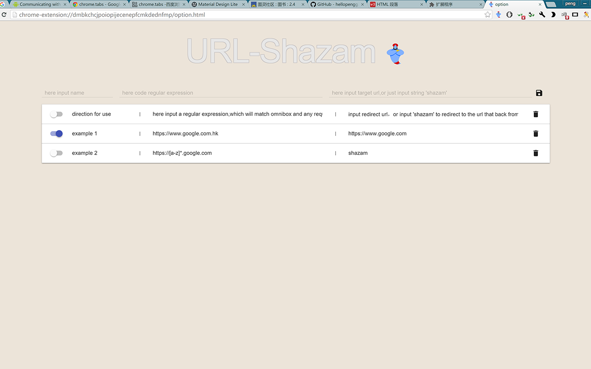

url_redirector 
===============================================
###this chrome extension help you redirect url through regular expression. 
you can input a regular expression,which will match omnibox and any request in the page. 
or input 'redirect' to redirect to the url that back from regular expression. 
settings will save and sync with google server if you login in google account. 
 
below is a screen shot： 

 
[点击下载](./url_redirector.crx) 
[chrome store](https://chrome.google.com/webstore/detail/urlredirector/dfoapkigebckfdljgmlphpbemdepbgjj?hl=zh-CN)

